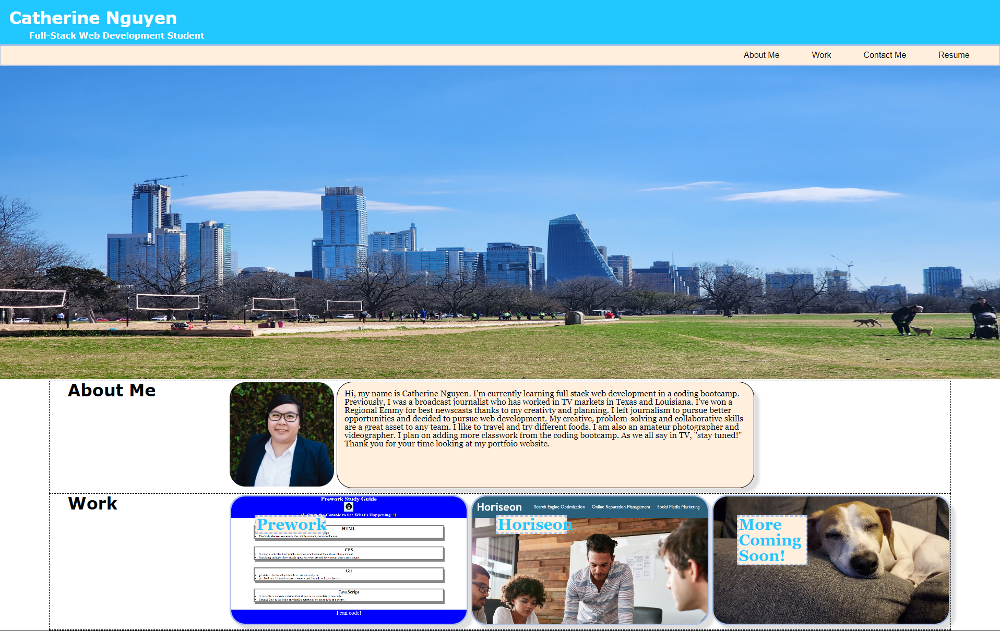

# Catherine Nguyen's Portfolio

## Description

This website is designed to showcase my previous work to potential employers. It shows what I have learned as a coding bootcamp student. I applied the skills I have learned into a website. The website also links to my previous project and features a section that says more work will be coming soon. I plan to update that section with future projects. I used HTML to create the skeleton of my website and CSS to design how I want it to be. The most time-consuming part of this project is making sure my styling elements work. I ran into issues that did not make my webpage responsive. After some trial and errors, I was able to have a website I'm proud of designing.

## Installation

N/A

## Usage

To use this website, the navigation bar in the top will take you to the corresponding section in the page. If you hover above the items in the navigation line, you'll see the background of the text changed to white. 
In the About Me section of the page, you can click on the headshot and it will go to my LinkedIn page. If you hover over the headshot and the cards in the work section, you'll see a glow effect. If you click on the text in the workcard, it will take you to the website. 
The contact me section is an easy way to reach out to me. Clicking on each link will direct you to a way to contact me or view my profiles. Hovering over the text should change the background to a beige color.

## Credits

N/A

## License

Please refer to the LICENSE in the repo.
